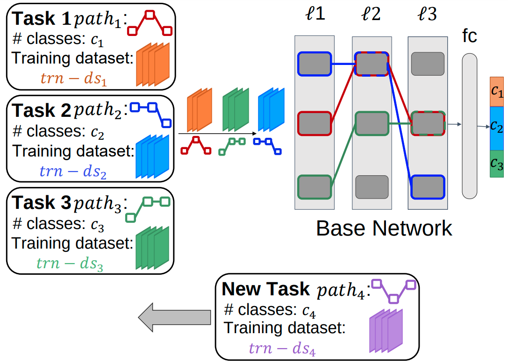

# PaRT: Parallel Learning for Robust and Transparent AI

This repository contains the code for PaRT, an algorithm for training a base network on multiple tasks in parallel. The diagram of PaRT is shown in the figure below. 

<p align="center">

</p>

Below, we provide details regarding dependencies and the instructions for running the code for each experiment. We have prepared scripts for each experiment to help the user have a smooth experience. 

# Dependencies
- python >= 3.8
- pytorch >= 1.7
- scikit-learn
- torchvision
- tensorboard
- matplotlib
- pillow
- psutil
- scipy
- numpy
- tqdm


# SETUP ENVIRONMENT 
To setup the conda env and create the required directories go to the scripts directory and run the following commands in the terminal:

```
conda init bash
bash -i setupEnv.sh
```

Check that the final output of these commands is:
```
Installed torch version {---}
Virtual environment was made successfully
```

# CIFAR 100 EXPERIMENTS 

Instructions to run the code for the CIFAR100 experiments: 

---------------------  BASELINE EXPERIMENTS --------------------- 

To run the baseline experiments for the first seed, go to the scripts directory and run the following command in the terminal:

```
bash -i runCIFAR100Baseline.sh ../../scripts/test_case0_cifar100_baseline.json
```

To run the experiment for other seeds, simply change the value of test_case in test_case0_cifar100_baseline.json to 1,2,3, or 4.

---------------------  PARALLEL EXPERIMENTS --------------------- 

To run the parallel experiments for the first seed, go to the scripts directory and run the following command in the terminal:

```
bash -i runCIFAR100Parallel.sh ../../scripts/test_case0_cifar100_parallel.json
```

To run the experiment for other seeds, simply change the value of test_case in test_case0_cifar100_parallel.json to 1,2,3, or 4.

# CIFAR 10 AND CIFAR 100 EXPERIMENTS 

Instructions to run the code for the CIFAR10 and CIFAR100 experiments: 

---------------------  BASELINE EXPERIMENTS --------------------- 

To run the parallel experiments for the first seed, go to the scripts directory and run the following command in the terminal:

```
bash -i runCIFAR10_100Baseline.sh ../../scripts/test_case0_cifar10_100_baseline.json
```

To run the experiment for other seeds, simply change the value of test_case in test_case0_cifar10_100_baseline.json to 1,2,3, or 4.


---------------------  PARALLEL EXPERIMENTS --------------------- 

To run the baseline experiments for the first seed, go to the scripts directory and run the following command in the terminal:

```
bash -i runCIFAR10_100Parallel.sh ../../scripts/test_case0_cifar10_100_parallel.json
```

To run the experiment for other seeds, simply change the value of test_case in test_case0_cifar10_100_parallel.json to 1,2,3, or 4.

# FIVETASKS EXPERIMENTS 

The dataset for this experiment can be downloaded from the link provided by the CPG [GitHub Page](https://github.com/ivclab/CPG) or [Here](https://drive.google.com/file/d/1a-FiCtYO_7nRcI9eIHrlZysq_0N3Sh2P/view). Instructions to run the code for the FiveTasks experiments: 

---------------------  BASELINE EXPERIMENTS --------------------- 

To run the baseline experiments for the first seed, go to the scripts directory and run the following command in the terminal:

```
bash -i run5TasksBaseline.sh ../../scripts/test_case0_5tasks_baseline.json
```

To run the experiment for other seeds, simply change the value of test_case in test_case0_5tasks_baseline.json to 1,2,3, or 4.


---------------------  PARALLEL EXPERIMENTS --------------------- 

To run the parallel experiments for the first seed, go to the scripts directory and run the following command in the terminal:

```
bash -i run5TasksParallel.sh ../../scripts/test_case0_5tasks_parallel.json
```

To run the experiment for other seeds, simply change the value of test_case in test_case0_5tasks_parallel.json to 1,2,3, or 4.

# Paper
Please cite our paper:

Paknezhad, M., Rengarajan, H., Yuan, C., Suresh, S., Gupta, M., Ramasamy, S., Lee H. K., PaRT: Parallel Learning Towards Robust and Transparent AI, 	arXiv:2201.09534 (2022)


